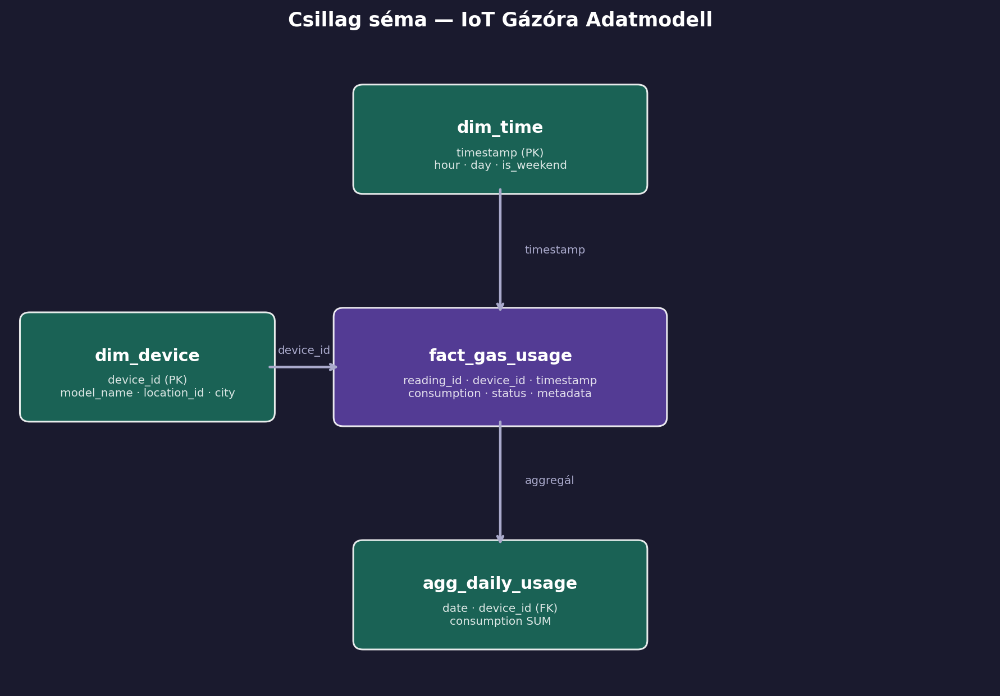
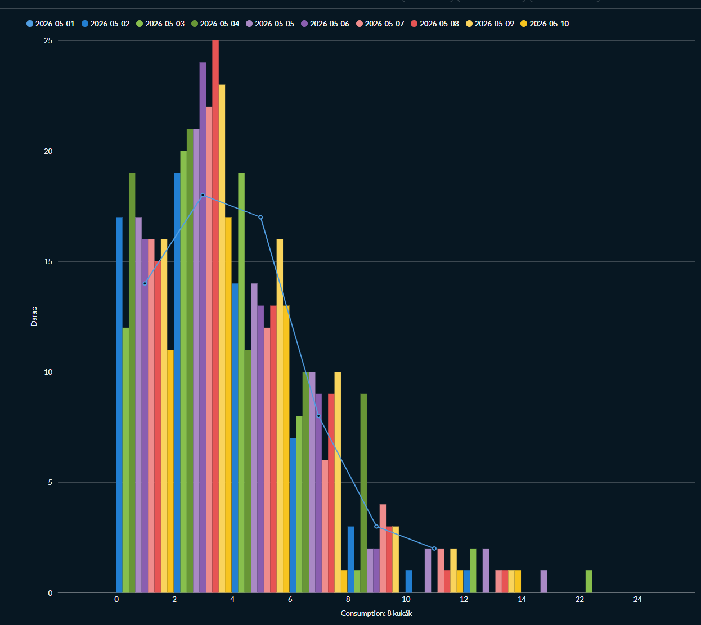
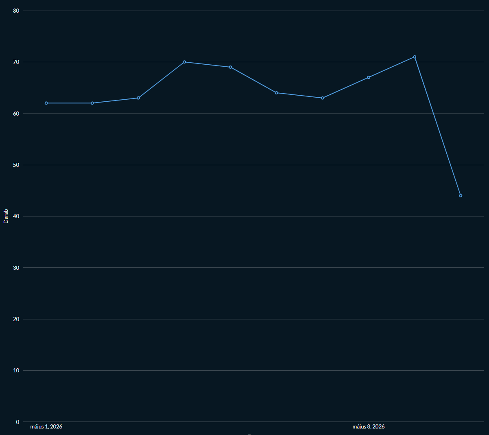

# Technikai Dokumentáció

**Projekt:** IoT Smart Meter Adatfeldolgozó Pipeline  
**Hallgató:** Dobos András  
**Dátum:** 2026.05.10

## 1. Architektúra
### 1.1 Választott architektúra: batch pipeline

A projekt egy egyszerűsített batch-orientált adatfeldolgozó pipeline-t valósít meg, amely az Itron-típusú IoT gázórák szimulált adatait dolgozza fel. Az architektúra a klasszikus **Medallion** (Landing → Warehouse) rétegezést követi.

```
Adatforrások          Landing Zone          Warehouse             Kiszolgálás
Faker (Python)  -->   MinIO / S3     -->    SQLite          -->   Metabase
CSV metaadatok  -->   (Parquet + CSV) -->   (Csillag séma)  -->   Jupyter
                        |
                      Airflow DAG orchestrálja az egész folyamatot
```

### 1.2 Komponensek indoklása

**Apache Airflow**
- Az orchestráció választása egyértelmű: az Airflow DAG-ok lehetővé teszik a pipeline lépéseinek függőség-alapú ütemezését, újrafuttathatóságát és megfigyelhetőségét. A @daily schedule biztosítja a rendszeres adatfrissítést.

**MinIO** 
- A Landing Zone szerepét egy lokális MinIO instance tölti be, amely teljes mértékben S3-kompatibilis API-t nyújt. Ez azt jelenti, hogy a kód változtatás nélkül futna valódi AWS S3-on is. A nyers adatok itt kerülnek tárolásra feldolgozás előtt.

**SQLite** 
- Eredetileg DuckDB volt tervezve adattárházként, amelynek számos előnye lett volna (oszlopos tárolás, beépített Parquet olvasás, analitikus SQL). Azonban a Metabase-DuckDB integráció az `AlexR2D2/metabase_duckdb_driver` közösségi driver segítségével valósítható meg, amely nagyon törékeny: a driver natív library-ja (`org.duckdb.DuckDBNative`) nem töltődött be a Metabase JVM környezetében (`Could not initialize class` hiba), annak ellenére, hogy a legújabb kompatibilis verzió volt telepítve. Mivel ez a driver egy nem-hivatalos, közösség által fejlesztett plugin, a kompatibilitás nem garantált. Az SQLite a Metabase által natívan, driver nélkül támogatott, és a batch pipeline méretéhez (napi ~1000 sor) teljesítménye tökéletesen elegendő. Sokkal kellemesebb volt a használata ezért inkább erre váltottam.

**Metabase** 
- Kódmentes vizualizációs réteg, amely közvetlenül az SQLite warehouse-ra csatlakozik. A Metabase lehetővé teszi dashboardok és native SQL kérdések létrehozását technikai tudás nélkül is.

**Jupyter Notebook** 
- A pipeline exploratív fejlesztéséhez és a DAG kód teszteléséhez használt interaktív környezet.

## 2. Adatmodell

### 2.1 Csillag séma (Star Schema)



### 2.2 Táblák leírása

| Tábla | Típus | Sorok száma | Leírás |
|---|---|---|---|
| `dim_device` | Dimenzió | ~100 | Mérőeszközök metaadatai (modell, város, azonosító) |
| `dim_time` | Dimenzió | ~1000 | Időbélyegek dekomponálva (óra, nap, hétvége flag) |
| `fact_gas_usage` | Tény | ~1000 | Nyers mérési adatok (fogyasztás, állapot) |
| `agg_daily_usage` | Aggregált | ~változó | Napi összesített fogyasztás eszközönként |

### 2.3 Adatforrások

**1. forrás -> Szimulált IoT mérési adatok (Parquet)**  
A `generate_fake_data()` függvény a Python `Faker` könyvtárával 1000 szimulált mérési rekordot generál. Az adatok Parquet formátumban kerülnek a MinIO-ba, amely tömörített, oszlopos tárolást biztosít.

**2. forrás -> Eszköz metaadat CSV**  
100 szimulált Itron gázóra eszköz leíró adatait tartalmazza: modellnév (`Itron-G4`, `Itron-G6`, `SmartGas-2000`), irányítószám és város. Ez a CSV a valódi Itron rendszerekben az eszközregisztrációs adatbázist modellezi.

## 3. Pipeline futásának eredménye

### 3.1 DAG gráf

```
[ingest_to_minio] --> [transform_to_sqlite] --> [run_analytics]
```

### 3.2 Analitikai lekérdezések

A pipeline futása után a `run_analytics` task három SQL lekérdezést futtat:

**1. lekérdezés - Top 10 legnagyobb fogyasztású eszköz**

```sql
SELECT 
    f.device_id,
    d.model_name,
    d.city,
    ROUND(SUM(f.consumption), 4) AS total_consumption
FROM fact_gas_usage f
JOIN dim_device d ON f.device_id = d.device_id
GROUP BY f.device_id, d.model_name, d.city
ORDER BY total_consumption DESC
LIMIT 10;
```

Kimenet : 
```
device_id,model_name,city,total_consumption
a4b1f8d5-a46d-4c2d-b3ba-09a5be38ef0a,Itron-G6,Dunnview,55.7432
9274b884-53d6-4ec7-8d45-d5be169e9a01,SmartGas-2000,South Victoriaton,46.8429
1b01fa51-5559-4198-aac6-56dab6feafa8,SmartGas-2000,South Nicholasberg,44.47
b6d54e12-95c0-4ca6-939e-5bcbf0792a94,SmartGas-2000,Smallberg,43.0313
2bb070ce-2984-4cc9-864a-813dba1215db,Itron-G4,East Douglas,38.6727
ade52f2e-02bc-4f24-94ef-07a37a12f809,SmartGas-2000,Christinemouth,38.5708
0ef25aad-7229-4fde-8627-2c6255224b34,Itron-G4,East Michael,38.3725
f8cd75af-7ca7-44bd-8d0f-7b4ad86c20e6,Itron-G6,Nicholsville,38.0714
5596454f-241a-4766-a588-379cc1a61904,SmartGas-2000,Lake Heiditon,36.8365
203af238-5545-49b6-bc3c-743274f9e7ce,Itron-G4,West Jenniferview,34.7371
```

**2. lekérdezés - Napi átlagfogyasztás trendje**

```sql
SELECT 
    date,
    ROUND(AVG(consumption), 4) AS avg_daily_consumption,
    COUNT(DISTINCT device_id)  AS active_devices
FROM agg_daily_usage
GROUP BY date
ORDER BY date ASC;
```
Kimenet : 
```
date,avg_daily_consumption,active_devices
2026-05-01,4.0538,62
2026-05-02,3.9222,62
2026-05-03,4.4196,63
2026-05-04,4.0354,70
2026-05-05,4.2486,69
2026-05-06,3.6167,64
2026-05-07,4.054,63
2026-05-08,3.9699,67
2026-05-09,4.2262,71
2026-05-10,3.5326,44
```

**3. lekérdezés - Eszközállapot megoszlása**

```sql
SELECT 
    status,
    COUNT(*) AS event_count,
    ROUND(COUNT(*) * 100.0 / (SELECT COUNT(*) FROM fact_gas_usage), 2) AS percentage
FROM fact_gas_usage
GROUP BY status
ORDER BY event_count DESC;
```
Kimenet : 
```
status,event_count,percentage
LOW_BATTERY,338,33.8
SIGNAL_LOSS,334,33.4
OK,328,32.8
```

### 3.4 Metabase dashboard

A Metabase-ben például az alábbi vizualizációk hozhatók létre a warehouse adataiból (És még sok más):

